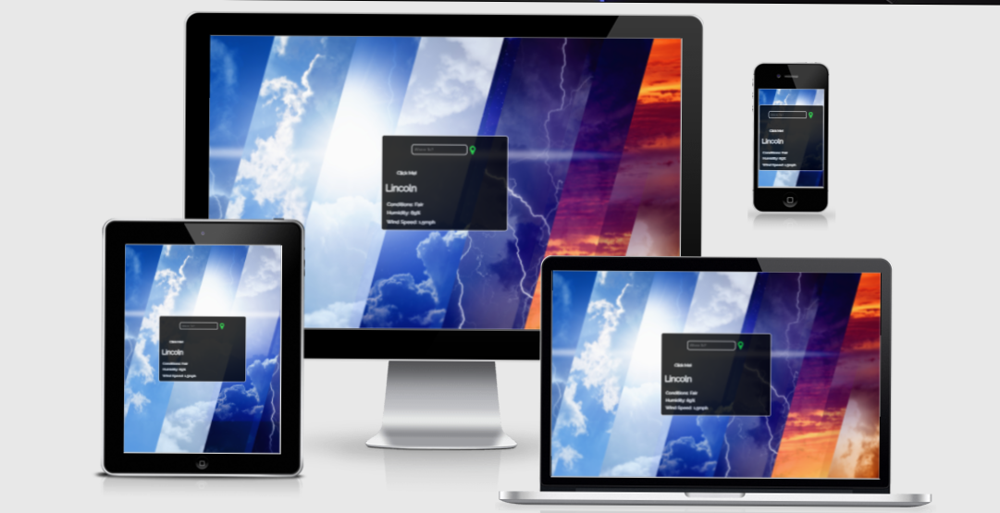

# [Paul Sweeney - MS2: Anyweather App.](https://paulsweeney-cmd.github.io/Anyweather-cmd/)

My goal for my second milestone project was to develop a simple weather app with some CSS styling to give it a sleek and professional look for the end user.
### This project was created using HTML, CSS and Javascript. JavaScript was sourced via online tutorial  "Jonah Lawrence, Dev Pro Tips". I took an interest in to working with API data as lessons covered Code Institutes Matt Rudge sparked my interest, and instead of making a memory game I went down the route of building something that could be used in a real world situation.

# 

1 - The aim of the app is pretty straight forward, the user enters their destination and the results returned show realtime conditions including, Temperature, Conditions i.e "Mild", "Fair" and so forth, Humidity and Wind Speed.

2 - In order for the app to retrieve the correct data in realtime, I have acquired an API key from [www.openweathermap.org](https://openweathermap.org/). I have amended the URL and updated this in JavaScript to allow the end user to search for weather by City. Unfortunately it cannot retrieve locations like villages or towns as there is no documentation available on the site.

3 - A goal was to amend the openweather url to allow user to get a 5 day weather forecast, see bugs and fixes section for more on this.

# Bugs & Fixes

- BUG: Javascript function to convert the units from Celsius to Farenheit not working
- FIX: **** UPDATE **** Bug not fixed: After numerous attempts with discussions involving various tutors on tutor support, we were unable to resolve the issue to allow the conversion to work when the button was clicked (Code has been left on the JavaScript file for reference, check JS file comment = 'JS for unresponsive unit conversion'), .

- BUG: OpenWeather api call unable to retrive data for a 5 day forecast, the documentation on the site requires you to amend the url, see below: 
### Original url: https://api.openweathermap.org/data/2.5/weather

### Attempted url: https://api.openweathermap.org/data/2.5/forecast
FIX: **** UPDATE **** Bug not fixed, 

- app.js:26 Uncaught (in promise) TypeError: Cannot read property '0' of undefined
    at Object.showWeather (app.js:26)
    at app.js:13
- The code was set for retrieving data for one set of weather data as opposed to a 5 day forecast.

- BUG: API wont communicate with the live site, [Click here for github site to test API](https://8000-rose-lobster-3bzpbxun.ws-eu03.gitpod.io/), checked for solution and further info on openweather API issues regarding live site and no information returned.

# Credits & Acknowledgements
## Credits
* The general layout was researched from various examples on Google Images and Jonah Lawrence, Dev Pro Tips.
* The background image was sourced from [Shutterstock](https://www.shutterstock.com/).

## Acknowledgements
* Input was reccomended by my mentor Nishant Kumar in regards to unit conversion and 5 day forecast.
* Javascript layout was sourced via Jonah Lawrence, Dev Pro Tips. This was to gain a better understanding of how JavaScript should be laid out in regards to application development. Additonal commenting was added to show my understanding. My intention was to build on it by researching further additions as per reccomendations from Nishant Kumar.

# Technologies
## 1. Coding Languages
* [HTML5](https://en.wikipedia.org/wiki/HTML5)
* [CSS3](https://en.wikipedia.org/wiki/CSS)
* [JavaScript](https://www.javascript.com/)
## 2. Libararies, Frameworks & Additional Programmes
* [Font Awesome 4.7.0](https://fontawesome.com/v4.7.0/): The Font Awesome library was used throughout the design to add responsive and unresponsive icons for a positive user experience.
* [Google Fonts](https://fonts.google.com/): Google Fonts was used to import the raleway, sans serif font style throughout my design.
* [Shutterstock](https://www.shutterstock.com/): Shutterstock was used for the background image.
* [GitHub](https://github.com/): GitHub was used to store all of my pushed code after completion to prevent loss through site crashes or otherwise.
* [Git](https://git-scm.com/): Git was used for version control and to make good use of my git pod terminal to push my code from Git to GitHub.

# Cloning the repository to GitHub Desktop:
1 - On GitHub, navigate to the main page of the repository.

2 - Above the list of files, click Code with the download icon.

3 - Click "Open with GitHub Desktop to clone and open the repository with GitHub Desktop".

4 - Follow the prompts in GitHub Desktop to complete the clone.

